# 考虑重复检测与观测不确定性的NIPT时点选择和异常判定

## 摘要
无创产前检测的时点选择同时涉及胎儿游离DNA浓度、重复检测相关性与延迟发现风险。针对2025年全国大学生数学建模竞赛C题，本文以男胎1082条记录、267名孕妇和女胎605条记录、147名孕妇为研究对象，将浓度关系解释、达标概率预测和条件风险决策分开建模，避免把同一孕妇的多次测序当作独立样本。
针对问题一，在Y染色体浓度的logit尺度上建立随机截距线性混合模型，并以低维加性样条作对照。孕周系数为0.04701，BMI系数为−0.02446，组内相关系数为0.7283；但按孕妇留出的预测决定系数为−0.0302，说明群体相关关系与个体预测能力不能等同。针对问题二，建立随机截距二项模型，对新孕妇随机效应积分获得边际达标概率，再以动态规划联合确定连续BMI分组与检测时点。在4%阈值、每日搜索网格和指定中延迟风险权重下，三组条件时点为11周、11周6天、12周6天，样本人数分别为200、25、42。
针对问题三，在相同验证划分下引入年龄、身高及孕产相关变量。两种固定多因素规格均未显示稳定预测增益；年龄和身高扩展方案给出11周、12周2天、12周6天的三组条件时点。利用18个同次抽血重复测序组估计logit测量波动尺度0.1237，并完成20轮主体重采样、4种额外噪声水平下的160次拟合。结果显示分组和时点对外部风险权重、达标阈值及样本扰动敏感，不能给出脱离这些条件的唯一最优时点。
针对问题四，采用主体隔离的正则化Logistic模型分别识别总体异常标记及T13、T18、T21标记。总体标记的平均精确率为0.3823，Brier分数为0.08419；T21平均精确率仅0.0302，表现不足。全文通过分组交叉验证、概率校准检查、可行性约束和敏感性分析给出可复核的题目解答，同时明确观测性数据、稀有标签和预约前变量可得性对推广的限制。
关键词：NIPT；重复测量；混合效应模型；动态规划；概率校准
<PAGEBREAK>

## 1 问题重述与研究思路
### 1.1 研究任务
题目研究利用孕妇外周血中的胎儿游离DNA进行无创产前检测时，如何兼顾检测可信度与异常发现时间。男胎Y染色体浓度可作为相关信号，题面以不低于4%作为重要判断条件；女胎没有相同的Y信号，需要依据其他染色体统计量、测序质量及孕妇特征判断异常。题面强调，过早检测可能因信号不足而失败，过晚发现又会压缩干预窗口。因此，本文讨论的“较好检测时点”不是单一预测模型分数最大的时点，而是在明确代价下作出的决策。
问题一要求解释Y染色体浓度与孕周、BMI等变量的关系并检验显著性。问题二要求按BMI合理分组，确定各组检测时点，并分析检测误差。问题三进一步考虑年龄、身高、体重等因素及达标比例，改进分组时点方案。问题四要求以女胎数据中的染色体非整倍体标记为判定目标，综合各染色体Z值、GC含量、读段及BMI等指标构造异常判定方法。四问的联系在于前两层模型为决策提供概率，但女胎异常标记的分类任务具有不同目标，不能直接沿用男胎浓度模型。
### 1.2 从相关关系到条件决策
本文按三个层次展开。第一层解释群体内和群体间的浓度差异，回答变量与浓度是否存在统计关联；第二层预测某个观测孕周的浓度达标概率，回答此时出现足够信号的可能性；第三层在指定代价和观测支持约束下优化分组方案。三层结果的含义不同：显著系数不能自动推出良好的个体预测，良好的概率预测也不能自动证明某个预约策略具有真实干预收益。
历史研究报告过孕周、母体体重与胎儿游离DNA比例的关联[1]，为变量选择提供背景，但不能代替本题附件的检验。本文不移植其他研究的最优阈值、分组切点或准确率；题面4%用于主分析，其他阈值仅作为敏感性设定。数据包含重复测量，采用随机效应刻画主体相关性，其统计动机来自纵向数据模型[2]。后续验证始终以孕妇为划分单位，使测试结果对应从未参与训练的新孕妇。
### 1.3 输出的使用范围
本文给出的BMI区间和孕周是附件人群、指定风险函数和既定信息条件下的计算解，而不是临床诊疗建议。附件没有随机分配检测时点，也没有完整观察每位孕妇首次达到阈值的全过程。因此，本文不声称识别了改变检测时点的因果效应。对于超出样本BMI范围、观测稀少的早孕时段，以及具有不同测序平台、随访机制的人群，应先补充数据再重新估计，而不能直接套用表中的数字。

## 2 数据审查、假设与符号
### 2.1 数据层级与基本情况
男胎工作表包含1082条测序记录、267名孕妇；女胎工作表包含605条记录、147名孕妇。男胎每位孕妇有1至8条记录，中位数为4条。同一孕妇可能在不同时间重复抽血，同次抽血又可能重复测序。这两类重复反映不同变异来源：前者包含随孕周变化及个体持续差异，后者更接近检测过程波动。合并或删除前必须明确所处层级，否则既可能丢失有用信息，也可能人为增大样本量。
表1列出主要数据事实。男胎观测孕周为11至29周，BMI范围约20.70至46.88。Y浓度有937条达到4%，145条未达到，不能把145条低浓度记录简单视为无效数据删除，因为它们恰好承载了检测过早失败的风险信息。图1展示重复记录数量分布，说明以记录数代替独立样本数会低估统计不确定性。
表1 数据结构与阈值观测概况
| 项目 | 数值 | 对建模的含义 |
| --- | --- | --- |
| 男胎记录／孕妇 | 1082／267 | 主体分组验证 |
| 女胎记录／孕妇 | 605／147 | 稀有标签与主体相关并存 |
| 男胎每人记录数 | 1—8，中位数4 | 不能默认独立同分布 |
| Y浓度达到4%的记录 | 937 | 达标记录占多数 |
| Y浓度低于4%的记录 | 145 | 保留为风险信号 |
| 首次观测已达标的孕妇 | 217 | 真实首次达标时间左删失 |
| 随访中观察到由未达标到达标 | 43 | 事件时间只能定位于区间 |
| 从未观察到达标 | 7 | 不能等同于永远不达标 |
| 出现阈值反转的孕妇 | 34 | 达标状态不严格单调 |

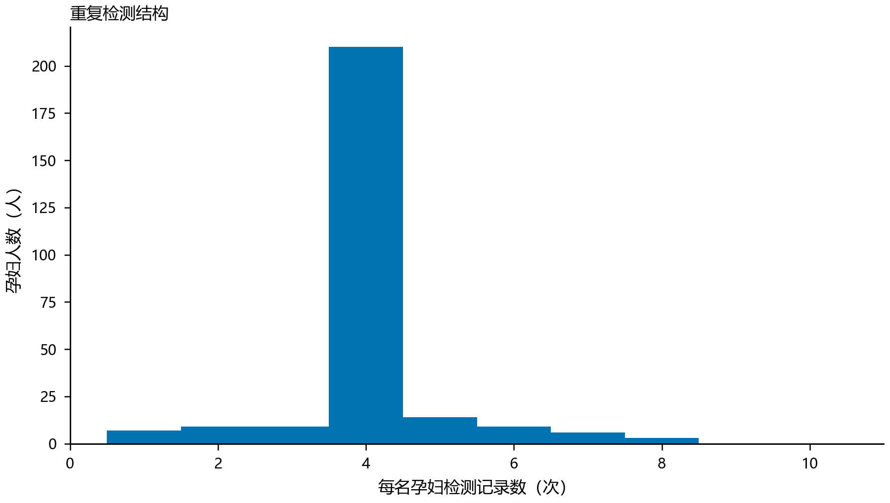

### 2.2 变量整理与泄漏防范
孕周统一换算为连续周数，即整数周加天数除以7；优化时再换回“周和天”，避免把小数部分误认为天数。百分比变量统一采用0至1比例尺度，4%对应0.04。BMI与身高、体重的关系用于一致性审查，而不意味着同时把三者无条件放入模型；将高度共线的变量同时加入小样本模型会放大不稳定性。原始附件保留不变，所有派生量由代码生成。
用于预约决策的特征必须在预约时已知。测序读段、过滤比例和GC含量属于检测后信息，本文不把它们直接作为首次检测时点选择的输入。Q2采用每位孕妇首条记录的BMI作为代理，Q3采用同一基线时点的年龄、身高等变量。这可以避免把后续检测BMI用于更早预约，但不能完全解决真实预约前没有这些数据的问题：如果某人的首条记录晚于推荐时点，所用BMI仅是回顾性代理。该限制必须与分组结果同时解释。
女胎异常目标取自题面指定的非整倍体标记列。该列空白按题面解释为未标记异常，不擅自改为缺失标签；“胎儿是否健康”在当前女胎数据中没有可用于此任务的类别变化，不作为独立验证金标准。X染色体浓度可能因估计方法出现负值，题面对这一现象已有说明，因此不按比例变量常规规则直接删除。缺失值填补和标准化在训练折内拟合，外层测试折只使用训练得到的变换。
### 2.3 必要假设及其可检验边界
第一，孕妇代码能够正确区分主体，同次抽血识别字段具有足够一致性。若主体代码实际发生混用，分组交叉验证也无法消除泄漏；本文的独立性假设建立在附件标识可靠的前提上。第二，模型以附件检测机制下的观测达标概率为目标，不把未观测孕周的状态当成已知事实。第三，随机截距用正态分布近似持续个体差异；其适用性通过拟合诊断、数值积分精度和外部主体预测检查，而不是只看训练似然。
第四，风险函数中检测失败损失与延迟损失可以加总；相对权重不是数据估计出的医学常数，而是外部决策情景。第五，BMI分组必须连续，组内采用共同孕周，便于解释和实施，但这种可操作性约束可能牺牲个体化预测收益。第六，误差分析中的追加噪声表示在现有数据上进一步扰动，不能解释为已经从原浓度中消除了测量误差。后文分别展示这些假设对结果的影响，而不把假设本身当成结论。
表2给出主要符号。下标i表示孕妇，j表示其检测记录；不同问题的模型参数单独估计，不因符号相同而共享数值。
表2 主要符号及单位
| 符号 | 含义 | 单位或范围 |
| --- | --- | --- |
| Yᵢⱼ | 男胎Y染色体浓度 | 比例，0至1 |
| tᵢⱼ | 检测孕周 | 周 |
| Bᵢ | 首条记录BMI代理 | kg/m² |
| Aᵢⱼ | 浓度达标指示 | 0或1 |
| τ | 达标阈值 | 主分析0.04 |
| bᵢ | 孕妇随机截距 | 模型链接尺度 |
| pᵢ(t) | 新孕妇在t时达标概率 | 0至1 |
| λ | 每周延迟代价 | 无量纲相对损失／周 |
| δ | 13周起附加延迟代价 | 无量纲相对损失 |
| C(a,b) | 排序后a至b号主体的最小组风险 | 累积相对损失 |

## 3 问题一：Y浓度关联分析
### 3.1 随机截距模型
直接对原比例响应进行无约束线性拟合可能产生范围外预测，并难以稳定刻画异方差。本文先对Y浓度作logit变换，再建立孕周、BMI及交互项的随机截距模型。所有使用该变换的观测均处于0与1之间，不需要人为截断。孕周和BMI分别按拟合样本均值中心化，模型写为式（1）。
$$
z_{ij}=\log\frac{Y_{ij}}{1-Y_{ij}}=\beta_0+\beta_t(t_{ij}-\bar t)+\beta_B(B_{ij}-\bar B)+\beta_{tB}(t_{ij}-\bar t)(B_{ij}-\bar B)+b_i+\epsilon_{ij} \quad (1)
$$
其中bᵢ表示该孕妇持续存在的浓度水平偏移，残差表示给定固定效应与随机效应后的记录波动。设随机截距方差为σᵦ²、残差方差为σₑ²，则同一孕妇两条记录的模型相关程度可用式（2）表示。它反映当前模型下的方差结构，不是某个生物过程的因果贡献比例。
$$
\rho=\frac{\sigma_b^2}{\sigma_b^2+\sigma_e^2} \quad (2)
$$
与普通最小二乘相比，随机截距使重复记录不再被当作完全独立的误差来源。需要注意，随机效应并不自动消除所有混杂：孕周和BMI随时间的变化、未记录的个体因素及选择性随访仍可能影响系数解释。因此本文将其称为关联模型，不称为因果模型。
### 3.2 系数、方向和显著性
表3给出完整样本估计。孕周主效应为0.04701，95%区间为0.04214至0.05187；BMI主效应为−0.02446，区间为−0.04018至−0.00874。在其他项按模型定义固定时，前者对应logit浓度随孕周增加，后者对应BMI较高与浓度较低相关。两者的统计证据均达到常用显著性水平。交互项估计为0.00120，但区间跨零，不能将其解释为已经证实的BMI调节机制。
表3 Y浓度混合模型的固定效应估计
| 项 | 系数 | 95%区间 | p值 |
| --- | --- | --- | --- |
| 截距 | −2.57364 | [−2.62810, −2.51918] | — |
| 中心化孕周 | 0.04701 | [0.04214, 0.05187] | 4.57×10⁻⁸⁰ |
| 中心化BMI | −0.02446 | [−0.04018, −0.00874] | 0.00229 |
| 孕周×BMI | 0.00120 | [−0.00022, 0.00262] | 0.09680 |

模型组内相关系数为0.7283，表明未由固定效应解释的持续个体差异占有较大比例。图2给出固定其余变量时的孕周关联曲线，图3给出BMI关联曲线。曲线用于解释方向和非线性对照，不能当作每位孕妇的必然轨迹；反变换后的固定效应曲线也不等同于对随机效应积分后的浓度算术均值。
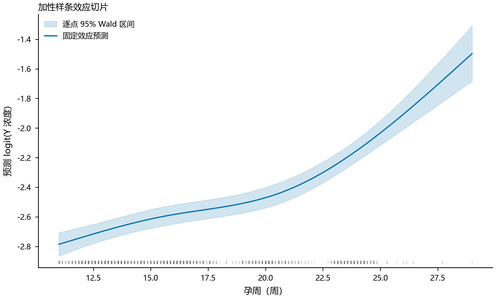
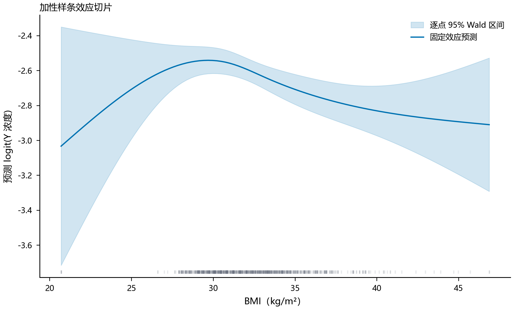

### 3.3 简单模型与非线性对照
为检查线性假设是否过强，采用低维自然三次加性样条替代线性孕周和BMI项，仍保留孕妇随机截距，属于同一纵向建模框架中的结构扩展。外层使用5折按孕妇分组的交叉验证；样条自由度在外层训练集内部通过3折主体划分从3和4中选择。所有外层折均保留未见孕妇作测试，不利用测试孕妇的重复记录估计其随机截距。
表4中的RMSE和MAE均在logit尺度计算。线性混合模型外层RMSE为0.5141，样条模型为0.5072，差异不大；主体平均误差比较的区间跨零，不能宣称样条取得稳定优势。图4展示这一比较，说明更灵活的函数形式只带来有限的样本内外差别。保留线性模型作为主要解释工具，是因为其关系清晰，而不是因其个体预测已经充分准确。
表4 问题一的新孕妇预测比较
| 模型 | 记录RMSE | 记录MAE | 记录R² | 主体平均RMSE |
| --- | --- | --- | --- | --- |
| 线性混合模型 | 0.51406 | 0.42321 | −0.03023 | 0.50628 |
| 加性样条混合模型 | 0.50717 | 0.41598 | −0.00278 | 0.50083 |

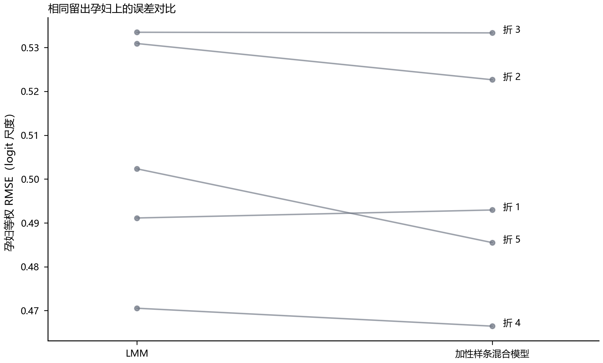

### 3.4 解释能力与推广能力的区别
线性混合模型包含已观测孕妇随机截距时，条件拟合R²约为0.7890；只使用固定效应时，训练R²约为−0.0254；对新孕妇的外层R²约为−0.0302。三者差异不是计算矛盾，而是信息条件不同。已知孕妇的历史检测帮助识别其个体偏移，新孕妇没有这一信息，只能依靠群体特征。若把条件拟合优度当作首次检测预测精度，会明显夸大模型能力。
问题一因此得到两类结论：孕周和BMI在当前模型中具有显著关联，重复测量相关性必须处理；但这些固定特征不足以准确解释新孕妇浓度差异。显著性回答参数是否偏离零，预测检验回答误差是否足够小，两者不应混用。后续问题直接围绕4%达标概率建模，既贴近题目决策目标，也避免把连续浓度拟合的高条件R²错误传递给时点优化。

## 4 问题二：达标概率与BMI分组时点
### 4.1 为什么不直接估计首次达标周
267名男胎孕妇中有217名在首次观测时已经达标，只知道真实首次达标发生在该时点或之前；43名在随访中出现未达标转为达标，但事件只能定位于两次采样之间；7名从未观察到达标，仍不能断言其未来不会达标。此外，34名出现阈值反转，使单调不可逆事件假设受到挑战。直接把首次观测到达标的孕周当作真实首次达标时间，会将抽血安排误认为生理过程。
因此，本文采用“某孕周的一次检测是否达标”为可识别目标，优化的是这一观测达标概率对应的风险，而不把它冒称为潜在首次达标时间分布。生存分析可以在额外假设下处理删失，但本题若要直接采用，还需说明反转、检测误差和随访选择机制。本文不在信息不足时强行增加一个难以验证的事件模型。
### 4.2 对新孕妇积分的二项模型
定义Aᵢⱼ为Yᵢⱼ不低于τ时取1、否则取0，主分析τ=0.04。使用孕周和首条BMI代理作为固定效应，随机截距表达同一孕妇检测结果的持续相关。条件概率与新孕妇边际概率分别见式（3）和式（4）。
$$
P(A_{ij}=1∣b_i)=\frac{1}{1+\exp[-(x_{ij}^{T}\beta+b_i)]},\qquad b_i\sim N(0,\sigma_b^2) \quad (3)
$$
 pᵢ(t)通过对随机效应分布积分得到，而不是简单令bᵢ=0。由于Logistic函数非线性，一般不存在“链接函数作用于平均值等于平均概率”的等式。新孕妇首次预约时不能使用其未来检测记录估计个体随机效应，因此该积分是预测条件的一部分。
$$
p_i(t)=\int_{-\infty}^{\infty}\frac{\phi(u)}{1+\exp[-(x_i(t)^T\beta+\sigma_bu)]}\,du \quad (4)
$$
参数通过边际似然数值优化求得，采用多个随机截距尺度初值，并逐级增加Gauss–Hermite积分节点，检查目标值及概率的数值稳定性。数值收敛只说明当前模型解已得到可靠近似，不能代替模型本身的预测验证。图5给出BMI条件下的达标概率随孕周变化情况，图6给出留出预测的校准关系。
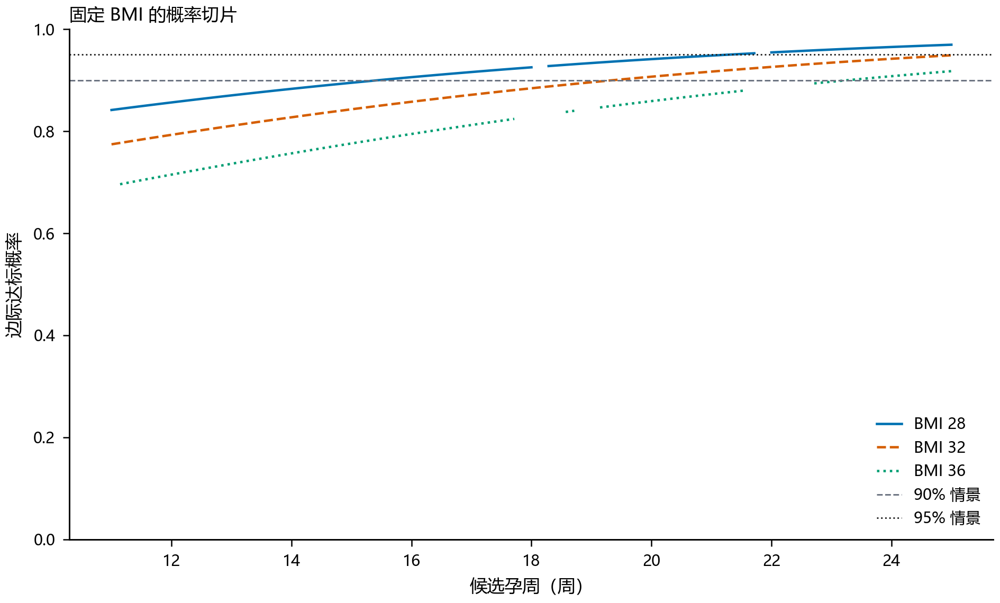
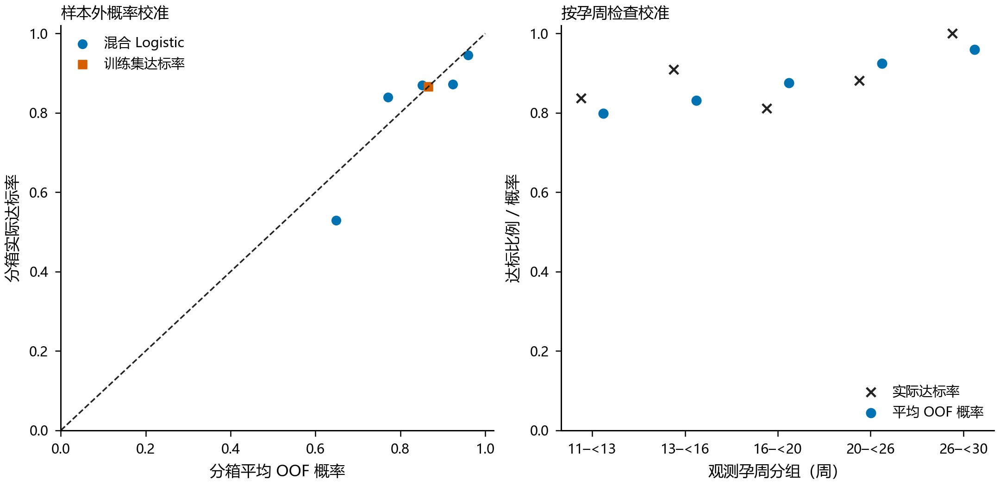

### 4.3 概率验证及观测支持
外层5折按孕妇分组，以每名孕妇记录平均Brier损失再对主体平均，避免多次检测者获得过大权重。作为对照，在每个训练折估计常数达标率，然后对测试折给出常数预测。二项模型主体Brier为0.11160，训练主体常数率对照为0.11315，训练记录常数率对照为0.11313。提升较小，配对主体误差区间跨零，说明概率模型并未显示强而稳定的外部优势。
图6中预测概率0.90至0.95的区间平均预测约0.924，而实际达标比例约0.872，提示高概率区域存在乐观偏差。因此不能直接给出“达到95%就安全”的保证。嵌套校准和低维样条变体的主体Brier分别约0.11278、0.11126和0.11231，未改变缺乏稳定增益的总体判断。校准参数仅在训练层估计，避免利用外层结果选择修正方式。
图7展示检测孕周的观测支持。仅69名孕妇的首次观测不晚于12周，早期数据覆盖有限。在69名早期主体上的敏感性分析会使预测产生可见变化，说明早期推荐尤其依赖样本选择。优化时增加“推荐周附近必须有足够主体观测”的约束可以限制明显无支持的解，但它不能凭空产生尚未采集的早孕信息。
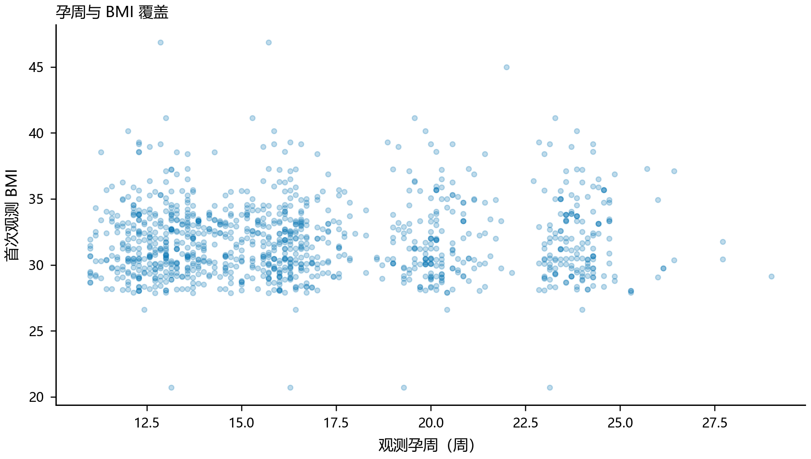

### 4.4 风险函数与连续分组
将失败损失定为1，定义式（5）的条件风险。每周延迟代价λ与13周起附加代价δ为外部输入。主展示情景采用λ=0.02、δ=0.10；另外考察λ为0、0.005和0.05的情景。题面给出的晚期风险等级没有对应的定量效用数据，故本文不声称这些权重由附件估计。搜索范围为11至25周，按一天离散；28周后的阶段不在该搜索域内。
$$
R_i(t)=1-p_i(t)+\lambda(t-11)+\delta I(t\geq13) \quad (5)
$$
先按基线BMI由小到大排序，在每个候选连续区间内为组内全部主体选择同一孕周。每名孕妇权重相同，原始组至少包含25名孕妇；同一个BMI值不得分到两侧。在候选时点前后1周内，至少要有10名训练孕妇提供观测支持。约束检查按主体而不是测序行数进行，防止重复检测制造虚假的样本支持。
对于排序位置a至b的一个候选组，在满足支持约束的孕周集合内计算式（6）。因组间损失可加，使用式（7）递推求取固定组数的最优连续划分。初始化空前缀零组的损失为0，不可行状态为无穷大。回溯得到切点和各组孕周，并对相邻同日组作合并。
$$
C(a,b)=\min_{t\in T_{a:b}}\sum_{i=a}^{b}R_i(t) \quad (6)
$$
$$
F(k,b)=\min_{a}\{F(k-1,a-1)+C(a,b)\} \quad (7)
$$
上述最优性仅针对已给定的概率、离散网格和约束。每个最优k组方案的最后一组必为某个连续区间，若其前k−1组并非相应前缀的最优解，就能替换后得到更小总损失，与最优性矛盾，因此递推穷尽合法划分即可得到离散全局最优。它不意味着风险函数正确，更不意味着医学意义上的全局最优。
合并相邻同日组不会改变任何主体的检测时间，也不会改变目标函数值。保留没有决策差异的切点会造成“分组越多越精细”的假象，因此正文报告合并后的实际方案，并保留最初求解组数作为计算条件。组数1、3和4均进行了比较，最终展示由4组求解后得到的有效分组。
### 4.5 问题二的条件答案
表5给出完整样本在4%阈值、中延迟情景下的有效三组方案。BMI边界展示至四位小数，实际计算使用未舍入值；区间左闭右开，最后一组包含样本上端点。第一组对应200名孕妇，11周为搜索下界；后两组分别为25名和42名孕妇。表中的人数是本附件的分组人数，不是对未来人群比例的估计。
表5 问题二的BMI条件分组及推荐时点
| BMI区间（kg/m²） | 人数 | 条件检测时点 | 说明 |
| --- | --- | --- | --- |
| [20.7031, 33.3589) | 200 | 11周 | 搜索域下界 |
| [33.3589, 34.4118) | 25 | 11周6天 | 达到最小原始组人数 |
| [34.4118, 46.8750] | 42 | 12周6天 | 位于13周阶跃之前 |

该表回答了题目要求的“如何分组、何时检测”，但必须连同风险权重解释。特别是12周6天靠近13周附加损失开始的前一天，体现离散风险设定，而不是生理机制证明该天特殊。11周是搜索域边界，也不能被解释为更早孕周必然不合适。观测不足、概率校准偏差及风险权重变化均可能改变表中时点。
当外层训练集产生一个策略，再把留出孕妇协变量代入训练模型计算期望风险时，所得只是模型自评风险，不能视为真实接受策略后的检测效果。本文把外层概率验证和全样本条件解分开报告，避免将二者混成已经完成前瞻性验证的结论。部署前应利用新的独立队列考察实际失败率和复检成本，才能进一步判断决策价值。

## 5 问题三：多因素扩展及分组调整
### 5.1 特征选择与可用信息
问题三要求考虑更多因素，但变量越多不等于答案越可靠。本文从预约前可得性和模型稳定性出发，固定两个扩展规格：基础扩展在Q2的孕周和基线BMI之外加入首条记录年龄、身高；完整扩展进一步加入辅助受孕、孕次与产次代理。BMI已包含体重和身高的组合信息，基础扩展不再把原体重与BMI、身高同时线性输入，以降低明显共线性。图8展示主要基线协变量分布与相互关系。
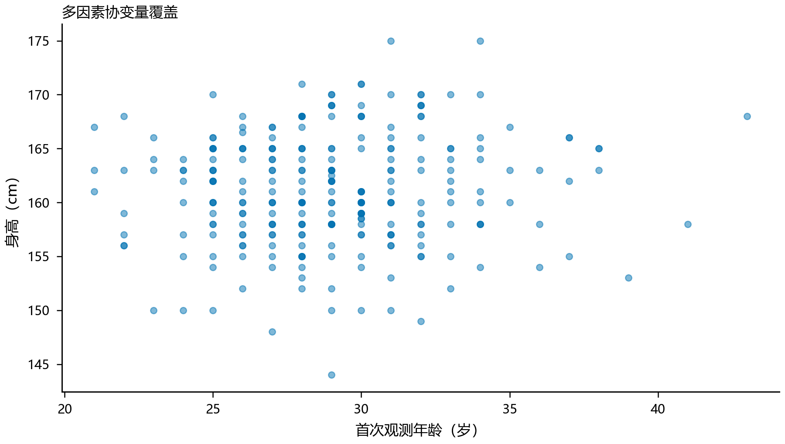

辅助受孕由附件标记编码，孕次中的“至少3次”等开放上端类别按3作代理，其含义是有序近似而非精确次数。该简化可能降低模型表达能力，故完整扩展不被视为多因素建模的全部可能形式。当前比较只回答这两个固定规格能否在相同数据和验证方式下稳定改进预测，不对未试验模型作否定判断。
测序质量指标在Q4的检测后判定中可以使用，但在Q3的首次预约中通常未知。将它们直接输入预约模型容易形成时间信息泄漏，因此本文没有以高预测分数为理由引入未来质量信息。若未来能够在预约时预测测序质量，可另建独立质量预测模型并传播其不确定性；本附件现阶段不支持把检测后实测质量作为已知输入。
### 5.2 同折配对比较
Q2、基础扩展和完整扩展使用相同的5折主体划分，因此可以比较每位孕妇的外层预测误差差值。定义正差值为扩展模型Brier更高，即表现更差；区间通过对已得到的主体损失差值重采样构造。该区间描述当前外层预测结果在主体层面的不确定性，不包含重新选择模型结构与反复训练产生的全部不确定性。
表6列出结果。基础扩展Brier为0.11192，比Q2高0.00032，区间为−0.00247至0.00312；完整扩展为0.11384，高0.00224，区间为−0.00132至0.00596。图9对应上述配对比较。两者都没有显示稳定改善，但区间也不支持“年龄、身高等因素完全无用”的绝对判断。
表6 固定多因素规格相对Q2的主体留出表现
| 规格 | 主体Brier | 相对Q2差值 | 差值95%区间 |
| --- | --- | --- | --- |
| Q2：孕周与BMI | 0.11160 | 0 | — |
| 基础扩展：加入年龄、身高 | 0.11192 | 0.00032 | [−0.00247, 0.00312] |
| 完整扩展：再加入孕产因素 | 0.11384 | 0.00224 | [−0.00132, 0.00596] |

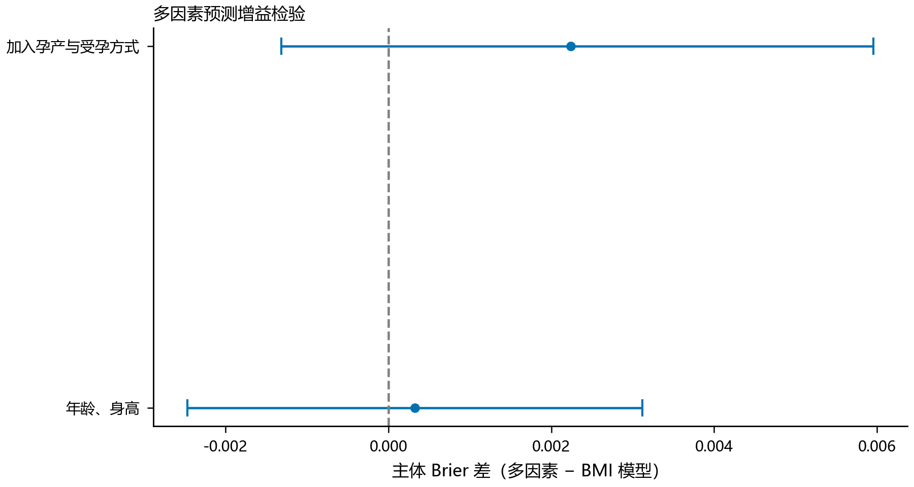

这一结果支持在当前数据下保持简洁主线，避免仅因问题列出多个因素就强行堆叠复杂模型。它也提示信息增益可能受样本规模、特征范围、测量误差及目标定义影响。某变量对连续浓度存在统计关系，并不保证能改进4%二元事件预测；某变量在已观测孕妇中有用，也不保证在首次检测的新孕妇中有用。模型比较必须与最终使用条件一致。
### 5.3 在多因素概率上仍按BMI分组
为了满足题目要求，扩展模型虽然按个人年龄和身高生成概率，但最终仍按BMI排序分组。在候选组中对各人的风险等权相加后选择共同孕周，而不是把年龄、身高全部固定在总体均值处。由此得到的是组内实际协变量分布上的平均条件方案。若未来同一BMI组的年龄、身高分布明显不同，组内平均风险与推荐时点也可能变化。
表7采用与问题二完全相同的中延迟权重、4%阈值、每日网格和支持约束，展示基础扩展方案。有效三组人数为203、31、33，中间组推荐12周2天。图10展示多因素条件方案与不同风险情景的关系。与表5相比，切点和中间组孕周有所变化，但其变化不能单凭训练风险下降就解释为临床改进，因为外层预测没有显示稳定优势。
表7 问题三基础扩展模型的BMI条件方案
| BMI区间（kg/m²） | 人数 | 条件检测时点 | 使用信息 |
| --- | --- | --- | --- |
| [20.7031, 33.4115) | 203 | 11周 | BMI、年龄、身高 |
| [33.4115, 35.0003) | 31 | 12周2天 | 同上 |
| [35.0003, 46.8750] | 33 | 12周6天 | 同上 |

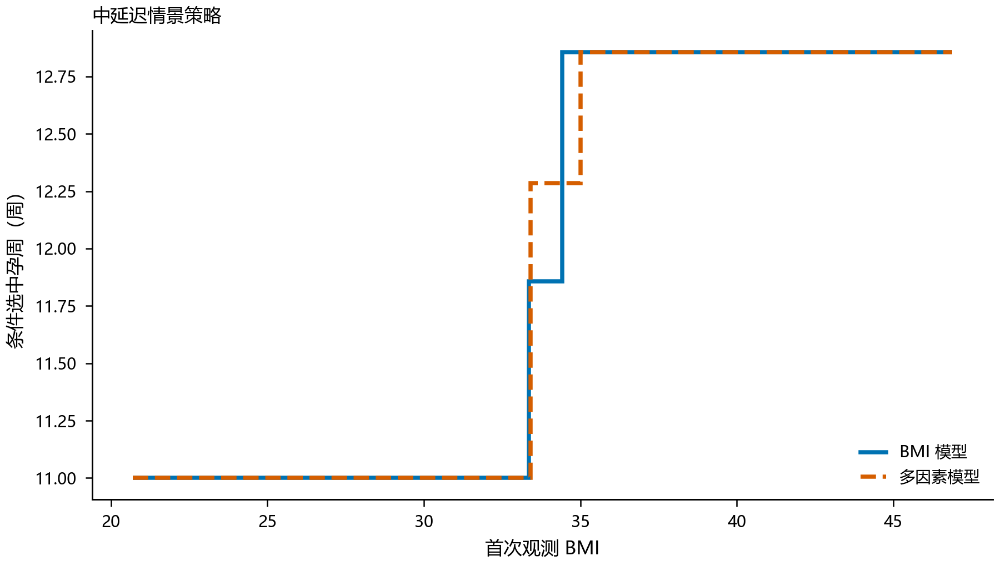

问题三的结论不是必须用多因素替代BMI方案，而是给出一个已明确构造、可检验的扩展解，并说明其增益尚不稳定。若首条年龄、身高信息可靠且希望考虑组内人群差异，可把表7作为条件方案；若强调简洁与解释，表5仍有保留理由。两者均需结合下一节的敏感性分析，而不能选取视觉上更整齐的一组切点作为唯一答案。

## 6 检测误差与决策敏感性
### 6.1 同次抽血重复测序的误差尺度
检测浓度的波动可能来自个体状态变化、抽血间隔及测序过程。为尽量减少孕周变化的混入，本文按孕妇、检测日期、抽血次数和孕周识别同次抽血重复测序组，共得到18组，涉及14名孕妇，每组两条记录。在logit浓度尺度上，使用组内平方和除以组内自由度估计波动方差，公式见式（8）。
$$
\hat\sigma_m^2=\frac{\sum_g\sum_{j=1}^{n_g}(z_{gj}-\bar z_g)^2}{\sum_g(n_g-1)} \quad (8)
$$
结果为σₘ=0.123745。对于每组两次测序，组内平方和已经等于两次差值平方的一半，不能再额外除以2，否则会低估方差。按14名孕妇进行2000次重采样，尺度区间约为0.08175至0.16770。由于只有14个独立主体，该区间并不包含所有平台误差来源，也不能证明其他人群具有相同测量精度。
采用重采样的基本思想是从样本经验分布近似研究估计量波动[4]；在当前重复测量情形中，重采样单位选择孕妇而非单条记录，是为了保留个体内相关性。技术重复并不一定具有完全相同的实验条件，因此σₘ更稳妥的名称是“同次抽血组内波动尺度”，而不是仪器纯误差标准差。正文不将这一有限估计推广为整个NIPT系统的精度标准。
### 6.2 主体重采样与追加噪声设计
从267名男胎孕妇中有放回抽取主体，保留抽中主体的全部记录。每个抽样槽位赋予独立编号，使同一原始孕妇被抽中两次时代表两个重采样主体，而不会在随机效应模型中被错误合并。Q2与基础扩展使用相同主体样本和相同噪声，形成配对比较。对logit浓度追加式（9）的随机扰动，再反变换并重新生成阈值标签。
$$
z_{ij}^{*}=z_{ij}+c\hat\sigma_m\xi_{ij},\qquad \xi_{ij}\sim N(0,1),\quad c\in\{0,0.5,1,1.5\} \quad (9)
$$
这里c=0仍包含主体重采样，只是不追加测量噪声；它不是完全不变的原始数据。c=1也不是对真实误差作了一次正确校正，而是在现有、已经带误差的观测上额外增加一个估计尺度的扰动。该试验检验方案对额外波动的敏感程度，不能用于估计去误差后的真实达标轨迹。阈值附近的记录容易因扰动翻转标签，远离阈值的记录通常较稳定。
共完成20轮重采样、4个噪声水平和2个概率规格，得到160次拟合及640个四组情景策略，没有拟合失败。优化梯度和数值积分差异均通过预设容差检查。20轮适合探索易变方向和发现极端方案，但不够支持尾部概率的精细估计，因此下表给出中位数与实际最小—最大范围，不把它标为95%置信区间。
### 6.3 噪声结果及解释
表8展示低延迟情景下每轮“主体平均推荐孕周”的汇总。它是整套策略对抽样主体的平均值，不是某一BMI组的孕周，也不是首次达标时间平均值。Q2在无追加噪声时的中位数约14.95周，范围12.86至23.82周；追加一个尺度后中位数约14.43周，范围扩展至12.08至25周。基础扩展具有类似的广泛波动。不同噪声尺度下中位数并非单调，不能总结成“误差越大就应越早检测”。
表8 低延迟情景下主体平均推荐孕周的20轮分布
| 模型 | 追加噪声倍数 | 中位数／周 | 实际范围／周 |
| --- | --- | --- | --- |
| Q2 | 0 | 14.95 | 12.86—23.82 |
| Q2 | 0.5 | 15.02 | 12.81—23.82 |
| Q2 | 1 | 14.43 | 12.08—25.00 |
| Q2 | 1.5 | 14.77 | 11.65—23.82 |
| 基础扩展 | 0 | 15.27 | 12.86—25.00 |
| 基础扩展 | 0.5 | 15.27 | 12.71—23.73 |
| 基础扩展 | 1 | 14.88 | 12.13—23.82 |
| 基础扩展 | 1.5 | 14.68 | 11.61—23.82 |

即使不追加噪声，主体重采样也能明显改变方案，说明不确定性不仅来自测量误差，还来自样本构成和模型估计。若只扰动预测结果而不重新拟合，可能遗漏这种结构变化；本试验在每轮重新拟合概率模型并重新分组，能够反映切点和共同孕周随数据变化的过程。但支持约束中的主体数在重采样时按抽样槽位计数，不能被误读为新获得了更多独立受试者。
### 6.4 阈值与风险权重
表9给出低延迟情景λ=0.005、δ=0.10下，Q2在不同阈值的条件结果。3.5%时所有主体合并为12周6天；4%时形成12周6天与25周两组；4.5%时仍为两种孕周，但早组人数降至38，晚组升至229。阈值改动不仅改变失败概率，也改变风险最小点，说明分组结论必须绑定阈值。
表9 Q2低延迟情景的阈值敏感性
| 浓度阈值 | 有效组数 | 内部BMI切点 | 检测时点 | 对应人数 |
| --- | --- | --- | --- | --- |
| 3.5% | 1 | 无 | 12周6天 | 267 |
| 4.0% | 2 | 33.8471 | 12周6天；25周 | 212；55 |
| 4.5% | 2 | 29.0781 | 12周6天；25周 | 38；229 |

25周方案出现在较低的每周延迟代价下，说明此时风险函数愿意用等待换取较高的模型达标概率；这不是推荐所有高BMI孕妇等到25周的医学结论。相反，在较高延迟代价下，有效方案趋于单一早期时点。不同外层划分中的中延迟方案可形成2至4个有效组，切点不是稳定的人体分类边界。风险函数没有真实成本标定时，选择一组最符合直觉的权重并称为唯一最优是不恰当的。
综合问题二和问题三，主结果表给出一个可执行的条件答案，敏感性结果说明其可变范围。更可靠的实际决策需要采集复检成本、失败后的等待时间、不同孕周发现异常的效用以及早期独立队列数据，再更新代价函数与校准模型。当前附件能够支持条件优化的计算过程，但不足以消除这些外部决策信息的缺口。

## 7 问题四：女胎异常标记判定
### 7.1 目标与特征
女胎分析以T13、T18、T21标记以及任一上述标记为四个独立二元目标。对应阳性记录数分别为23、46、13和67，涉及18、30、12和44名孕妇；其余记录按题面标签含义处理。图11展示阳性主体数，提示少数异常类别尤其是T21的验证不确定性较大。总体异常目标不是临床确诊结果，而是题面标记的复现与预测。
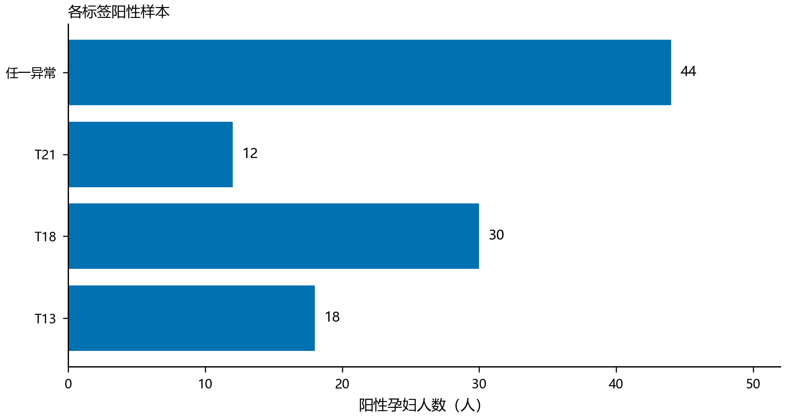

输入包括13、18、21号染色体Z值、X染色体Z值、X浓度、GC含量、原始读段数、比对比例、重复比例、唯一比对读段数、过滤比例、检测孕周、BMI和年龄，共14个特征。这些特征在本问的检测后判定时已经可用，与前两问预约前信息条件不同。既有研究使用多个测序特征辅助NIPT异常识别[3]，但其性能不直接移植到本附件；本文采用简单正则化模型检验当前数据是否支持有效区分。
### 7.2 正则化概率与阈值选择
对每个目标分别拟合L2正则化Logistic模型，正则化强度固定为C=0.1，不在外层结果上搜索参数。中位数填补与标准化均仅使用训练数据。未采用类别权重，以免在没有相应校准处理时把改变后的类别代价误当成真实概率。模型估计式（10）的概率，再用训练层选择的阈值进行判定。
$$
q_i=\frac{1}{1+\exp[-(\alpha_0+\alpha^T v_i)]},\qquad \hat A_i=I(q_i\geq h) \quad (10)
$$
每个目标使用3折分层主体划分，外层用于报告泛化结果；在外层训练部分再作3折主体划分，利用内层预测选择MCC较好的阈值h。外层测试标签不参与缺失填补、标准化、拟合或阈值选择。由于不同目标的阳性主体不同，各目标独立分折，不能把四列外层预测拼接为一个已经验证的联合多标签分类器。
模型判定流程是：读取目标检测的14项特征，应用训练所得填补和标准化，计算目标概率，再与相应训练阈值比较。最终输出应同时保留概率和判定，不把二元结果伪装成确诊。MCC在当前实验中用于平衡混淆矩阵各项，但并未编码临床漏诊代价；如果用途要求极高灵敏度，应事先设定目标灵敏度、再在独立数据验证，而不能从当前测试折挑选看起来最好的阈值。
### 7.3 指标及总体结果
类别不平衡时，高准确率可能仅来自预测全部正常。本文报告ROC-AUC、平均精确率AP、Brier分数、灵敏度、特异度和混淆矩阵。其中AP按召回增量加权精确率计算，不与梯形积分PR-AUC混称。记录Brier见式（11）；主体Brier先在每名孕妇内平均再跨主体平均，用于减少重复记录数量差异的影响。
$$
\operatorname{Brier}=\frac{1}{N}\sum_{i=1}^{N}(q_i-A_i)^2 \quad (11)
$$
表10显示T18和总体标记的概率表现优于各自训练折常数率对照，而T21区分能力不足。总体AP为0.3823，Brier为0.08419，ROC-AUC为0.7711；但在训练选择的MCC阈值下，灵敏度只有0.1791。概率排序和某个二元阈值下的临床可用性是不同问题，不能仅凭AUC或AP较高就声称适合高敏感筛查。
表10 女胎主体隔离外层验证的记录级指标
| 目标 | ROC-AUC | AP | Brier | 灵敏度 | 特异度 |
| --- | --- | --- | --- | --- | --- |
| T13 | 0.6796 | 0.1967 | 0.03317 | 0.1739 | 0.9210 |
| T18 | 0.7943 | 0.2924 | 0.06252 | 0.5000 | 0.8551 |
| T21 | 0.4467 | 0.0302 | 0.02123 | 0.1538 | 0.8361 |
| 任一异常标记 | 0.7711 | 0.3823 | 0.08419 | 0.1791 | 0.9851 |

表11进一步给出混淆矩阵。总体异常67条阳性记录中只识别出12条，遗漏55条；T21仅识别2条、漏掉11条，同时产生97条假阳性。这些失败结果必须公开。尤其不能用总体任务的较好概率结果掩盖T21的弱表现，也不能把特异度高解释为异常不会被漏掉。
表11 各目标外层判定的混淆矩阵
| 目标 | 真阳性TP | 假阳性FP | 假阴性FN | 真阴性TN |
| --- | --- | --- | --- | --- |
| T13 | 4 | 46 | 19 | 536 |
| T18 | 23 | 81 | 23 | 478 |
| T21 | 2 | 97 | 11 | 495 |
| 任一异常标记 | 12 | 8 | 55 | 530 |

### 7.4 校准与不确定性
图12给出总体异常概率的校准分箱。较高概率区间样本较少，例如最高展示箱只有10条记录、9名孕妇，不能因少数箱接近对角线就宣称模型已经充分校准。较低概率区间虽然记录较多，仍需注意同一孕妇多次检测的相关性。校准检查应同时看概率差异和支持人数，不能只看曲线是否平滑。
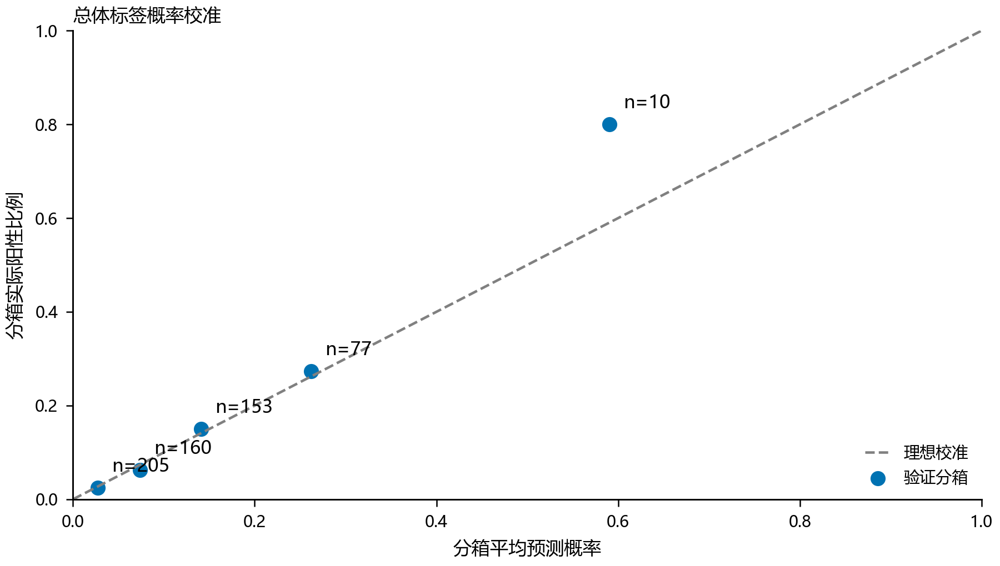

对147名孕妇的固定外层平均损失进行2000次配对重采样，得到模型相对常数率对照的主体Brier差值区间，结果见图13和表12。T18差值约−0.00929，区间−0.01685至−0.00294；总体差值约−0.01527，区间−0.02575至−0.00663；T13与T21区间跨零。这些区间支持当前预测下的相对比较，但不包含重新训练、重新分折或目标选择的不确定性。
表12 女胎模型相对常数率的主体Brier差值
| 目标 | 差值 | 主体重采样95%区间 | 解释 |
| --- | --- | --- | --- |
| T13 | −0.00375 | [−0.00949, 0.00025] | 增益不稳定 |
| T18 | −0.00929 | [−0.01685, −0.00294] | 当前外层概率有改善 |
| T21 | 0.00021 | [−0.00016, 0.00055] | 未显示改善 |
| 任一异常标记 | −0.01527 | [−0.02575, −0.00663] | 当前外层概率有改善 |

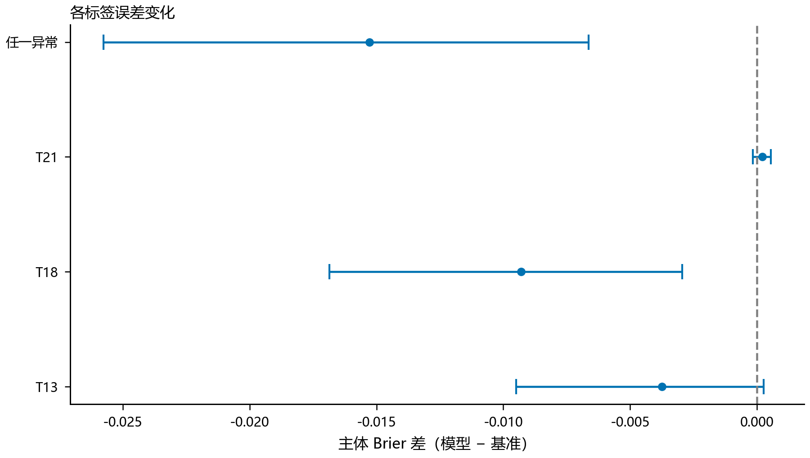

### 7.5 判定方法的局限
问题四的最终产出是带有验证结果和失败边界的异常标记判定流程，而不是可直接用于临床诊断的分类器。附件中的标记可能本身依赖染色体统计量，模型学习到的部分关系可能是原标记规则的再表达；缺少独立确诊金标准时，不能把与标记一致称为确诊准确率。即使主体划分没有泄漏，标签定义层面的依赖仍须单独说明。
稀有阳性主体限制了模型复杂度和校准精度。当前T21只有12名阳性孕妇，增加高容量模型并不能自动产生缺失信息，反而可能扩大方差。改进应优先补充独立阳性样本、核对标签与临床结局关系、预先确定漏诊代价，再比较模型。本文保留低复杂度方法和负面结果，以免用大量算法试验造成选择性报告。

## 8 综合评价与结论
结合表1和表2的数据口径、表4与表6的主体预测比较，以及表10和图12的分类概率表现，可以看到：本文各项结果必须在对应样本单位、链接尺度和信息条件下解释，不能用某一项较好的数字代替整套验证。
### 8.1 方法优点
本文首先把主体、抽血和测序层级分开，避免重复记录造成虚假的独立样本量；其次将关联解释、概率预测和风险决策明确拆分，避免把训练拟合优度直接转化成预约建议。对新孕妇采用随机效应积分，使信息条件与首次检测相匹配。连续BMI分组通过动态规划求解，并加入最小主体数、同值不拆分和局部观测支持约束，给出明确的可行解与离散最优性范围。
验证围绕实际推广目标设计：外层按孕妇划分，内层才进行样条选择、校准或阈值设定；对照使用训练折常数率，避免异常类别占比带来的误导；误差试验既重新抽样主体又重新拟合模型，覆盖分组变化而不只是给固定曲线增加误差条。各问均保留未显示稳定优势的方案和失败类别，使结论能够反映数据本身的限制。
### 8.2 主要不足
数据来自特定检测与随访机制，高BMI、早孕时段以及稀有异常的覆盖不均匀。当前随机截距模型没有完全描述选择性复检，也没有识别复检安排与潜在浓度之间的依赖。首条BMI作为预约前代理是回顾性假设，不能在更早时点真实获得的信息必须另行采集。支持约束只是避免明显无数据区域，并不等于排除了外推风险。
风险函数权重尚无真实效用标定，13周阶跃会导致12周6天附近的边界解，11周和25周也会受搜索域影响。测量尺度仅由14名孕妇的同次抽血重复估计，20轮追加噪声试验只适合探索，不支持精细尾部推断。女胎目标是筛查标记而非确诊结局，当前阈值选择没有编码临床漏诊成本。这些局限不会使计算结果无效，但会限制结果的解释与应用范围。
### 8.3 四问答案
问题一：孕周与Y浓度呈正向统计关联，BMI呈负向关联，交互项证据不足；图2和图3展示方向，表3给出估计与区间。组内相关系数0.7283表明必须处理重复测量；图4及外层R²为−0.0302说明显著关联不等于足够的个体预测能力。
问题二：使用边际达标概率、连续BMI动态规划和观测支持约束，得到表5的条件三组方案：11周、11周6天和12周6天。该答案绑定4%阈值与中延迟代价，不具有脱离代价的唯一最优含义。图5展示概率趋势，图6和图7同时揭示校准及早期观测限制。
问题三：引入年龄、身高后，表7给出11周、12周2天和12周6天的条件三组方案，但图9与主体Brier差值区间表明两个固定扩展规格均无稳定增益。160次重拟合显示方案对样本和追加噪声敏感，表8和表9说明必须同时报告风险、阈值及误差条件，不能把某组切点解释为稳定生物学分界。
问题四：主体隔离的L2 Logistic流程可以提供各异常标记概率和阈值判定。总体AP为0.3823、Brier为0.08419，T18及总体概率相对常数率有所改善；但T21 AP仅0.0302，总体阈值灵敏度仅0.1791，不支持将当前方法直接用作高敏感临床筛查。图13和表11共同说明概率改善与实际漏判风险需要分别评价。
总体而言，附件能够支持一个可解释、可求解且经过主体层面验证的条件决策框架，却不能支持无条件的临床最优时点或高准确度诊断承诺。下一阶段若增加预约前基线资料、早期独立采样、复检成本和确诊结局，便可在相同框架中更新概率与代价，而不必推翻已建立的重复测量处理和验证原则。

## 参考文献
[1] Wang E, Batey A, Struble C, et al. Gestational age and maternal weight effects on fetal cell-free DNA in maternal plasma. Prenatal Diagnosis, 2013, 33(7): 662–666. DOI: 10.1002/pd.4119.
[2] Laird N M, Ware J H. Random-effects models for longitudinal data. Biometrics, 1982, 38(4): 963–974. DOI: 10.2307/2529876.
[3] Yang J, Ding X, Zhu W. Improving the calling of non-invasive prenatal testing on 13-/18-/21-trisomy by support vector machine discrimination. PLOS ONE, 2018, 13(12): e0207840. DOI: 10.1371/journal.pone.0207840.
[4] Efron B. Bootstrap Methods: Another Look at the Jackknife. The Annals of Statistics, 1979, 7(1): 1–26. DOI: 10.1214/aos/1176344552.
